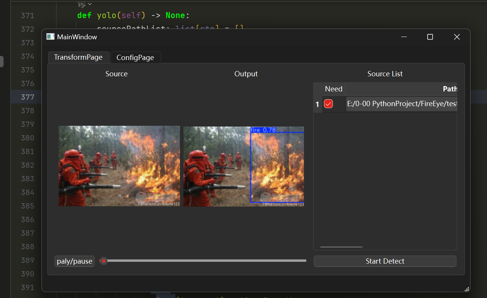
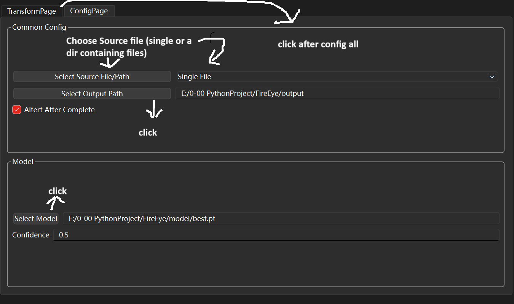
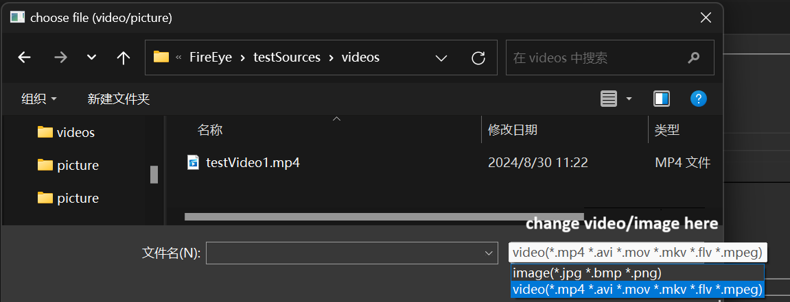
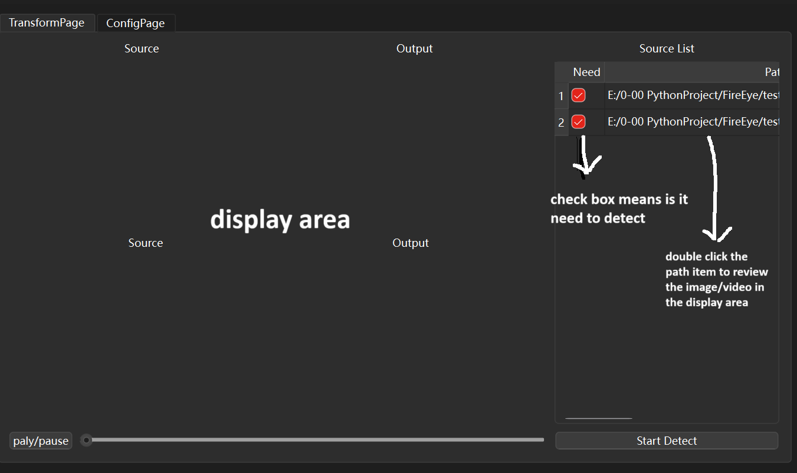
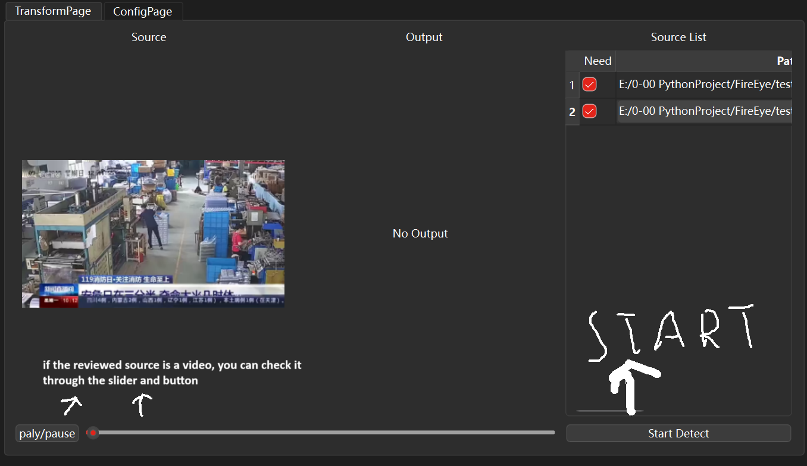
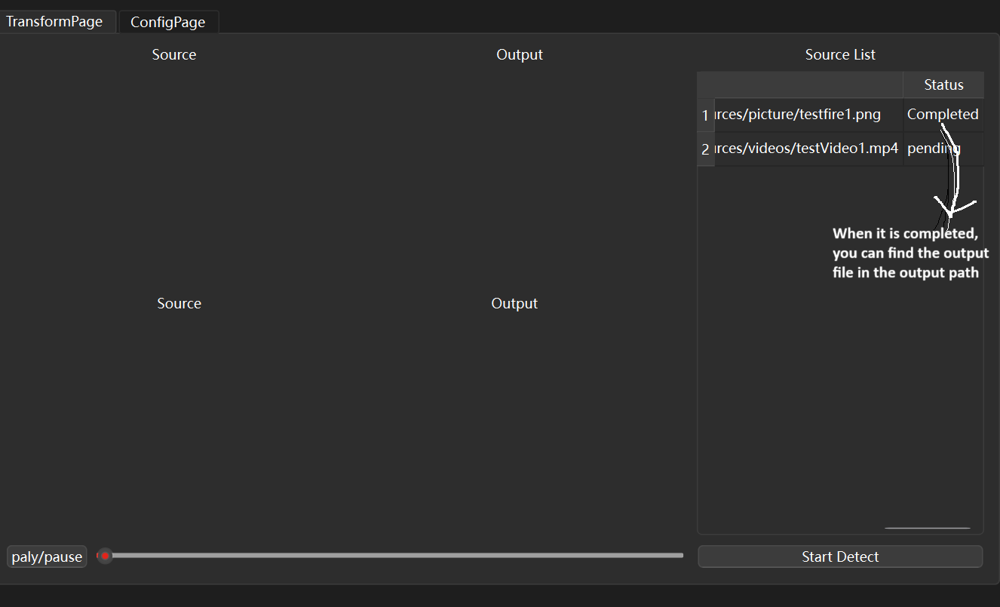

# FireEye
FireEye is a Simple Gui Using YOLOv8 to Detect Fire in the picture or Video.\
It is developed based on PySide6\
With the help of YOLOv8 and PySide6, it is more convenient to use, improve and develop.\
all you need to do is to Config the path of __output folder__, and the __output path__, then __select__ the file you want to detect 
then turn to the detect tab then __click__ the __detect button__.

### Requirements

1. python 3.10
2. pip install -r requirements.txt

### Using Guide

1. Install the requirements
2. run main.py
3. 
4. 
5. 
6. 
7. 
